# **Dockers - Quick Start**


A short-guide focused on implementing custom Dockerfiles

*2020-10-30 Mirek Jaros*

---

# 1. What is a Docker?

- Docker is an **eco-system** to allow us to **configure**, **deploy** and **run applications** on production systems. 

    - *eg. Apache Tomcat Web Server + Java Enterprise Application*
<br />

- As a **tool, helps** engineers to **easily run applications locally**.

     - *eg. Oracle Database Express Edition for local development*

---

# 2. Comparison to VMs

- Comparison between Docker Engine and  Hypervisors
(Hyper-V, ESXi, VBox,..)
<br />

- You can run limited N instances of VMs 

   *vs.*

- Very high number V of Docker Containers within same hardware


---

# 3. Prerequisite

- Before next steps **make sure your Docker Desktop is running**
  https://docs.docker.com/desktop/

- It's possible to have only Docker Engine, however, you would have to use CLI

- And installation of just engine is usually performed under high-priviledged account, requires deeper knowledge around security

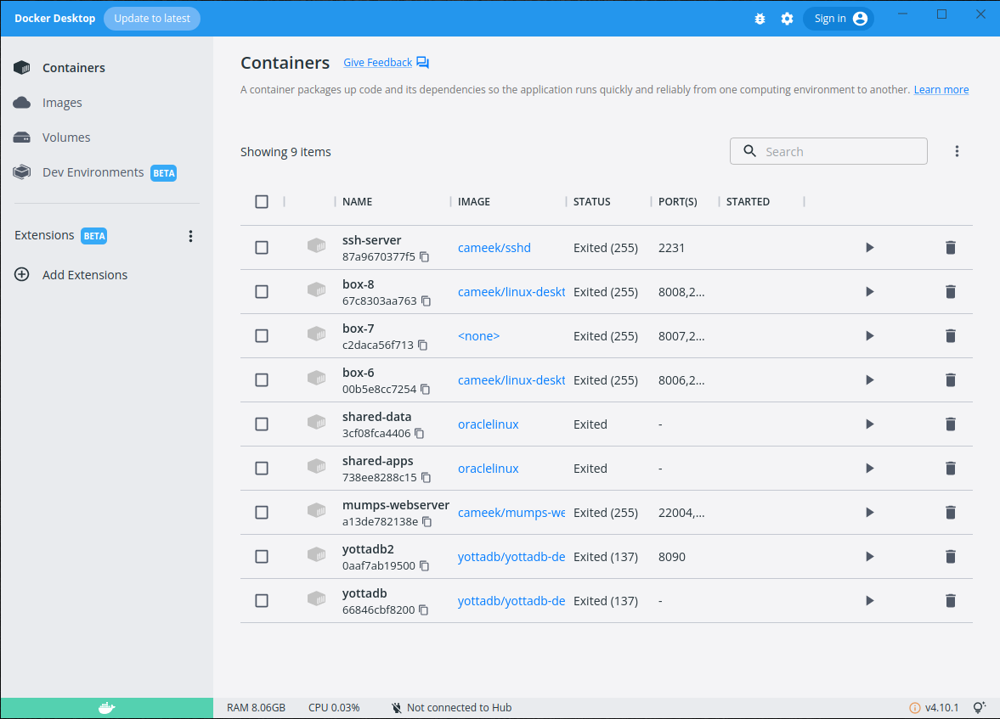

---

# 4. First Dockerfile

- Create dedicated directory like "Hello-Docker"
- Inside the directory create new file "Dockerfile" with following content:
```Dockerfile
FROM ubuntu:latest
```
- You can use Vi, Notepad,.. or some IDE like VSCode

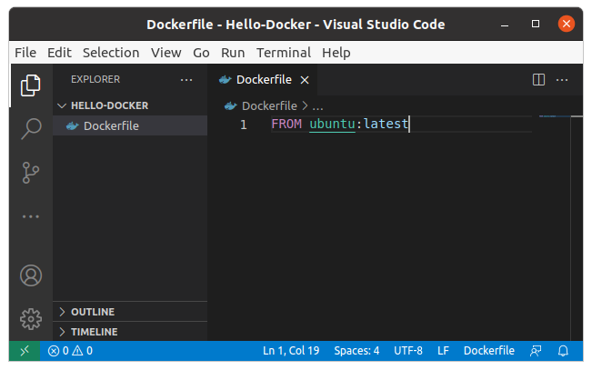

---

# 5. Build Dockerfile into Image

- Open a command line or shell, navigate to project "Hello-Docker"
- Execute the build, don't forget to put there the dot:
```sh
docker build --tag my-hello-docker .
```

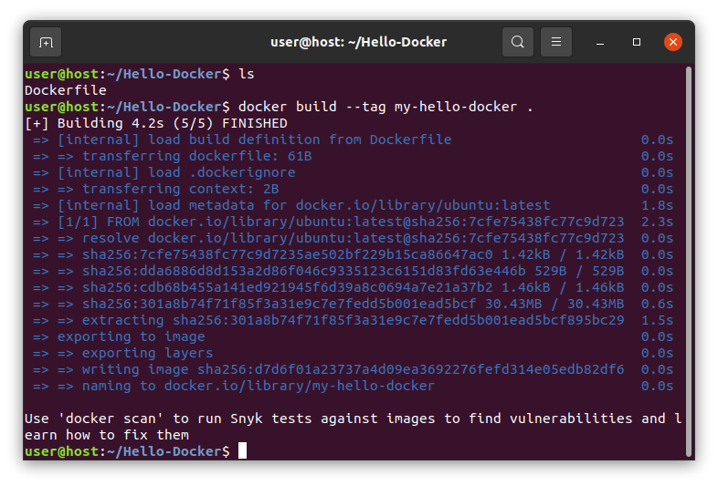

---

# 6. Check Images via GUI

- In Docker Desktop click on Images

- The new image name "my-hello-docker" should be there

- You can use search filtering

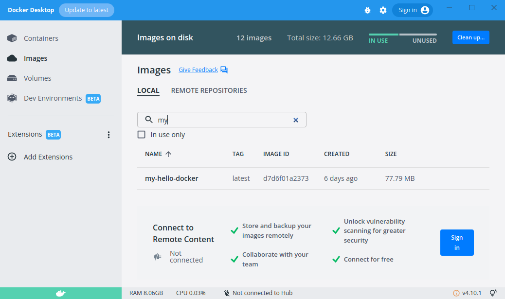

---

# 7. Check Images via CLI

- In shell/command line run following: 
```sh
docker images -a
```

- The switch "-a" displays also inactive images

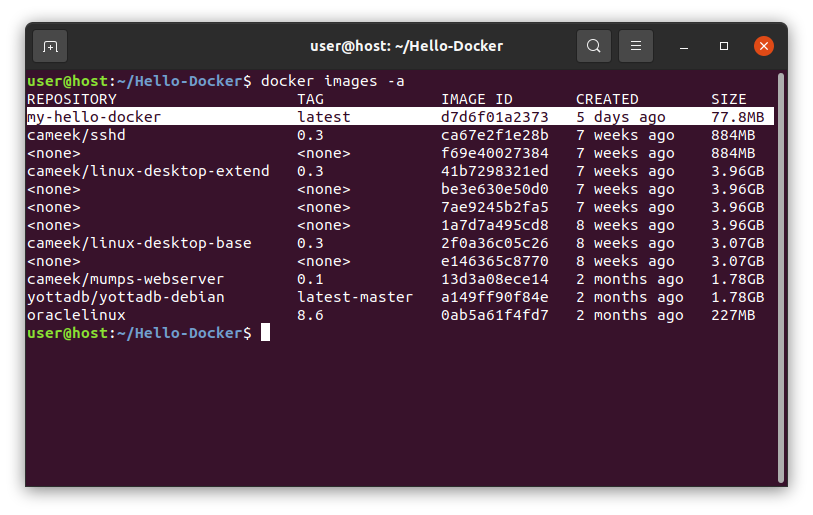

---

# 8. Run New Container

- Using CLI execute command: 
```sh
docker run -it --name my-hello-docker-1 my-hello-docker
```

- You should get immediately interactive terminal inside that container with Bash shell

- You can try commands like *ls*

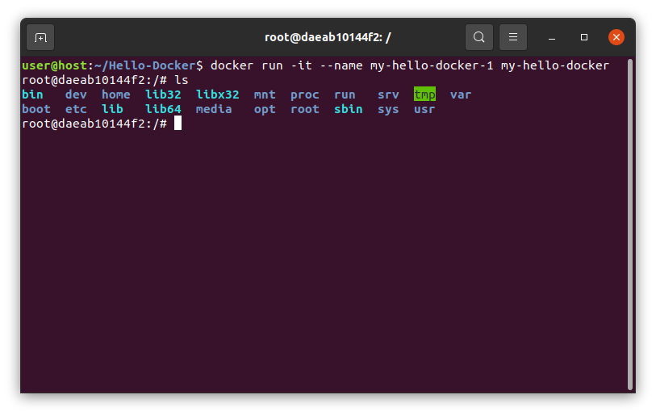

---

# 9. Check Containers via GUI

- In Docker Desktop click on Containers

- The new created container "my-hello-docker-1" should be there

- You can use search filtering

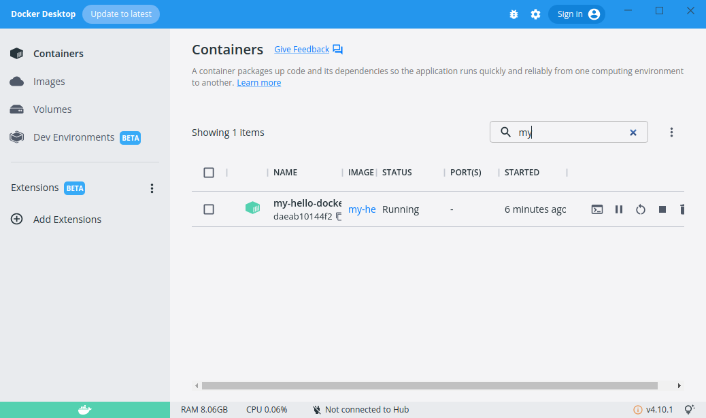

---

# 10. Check Containers via CLI

- In shell/command line run following: 
```sh
docker ps -a
```

- The switch "-a" displays also inactive images

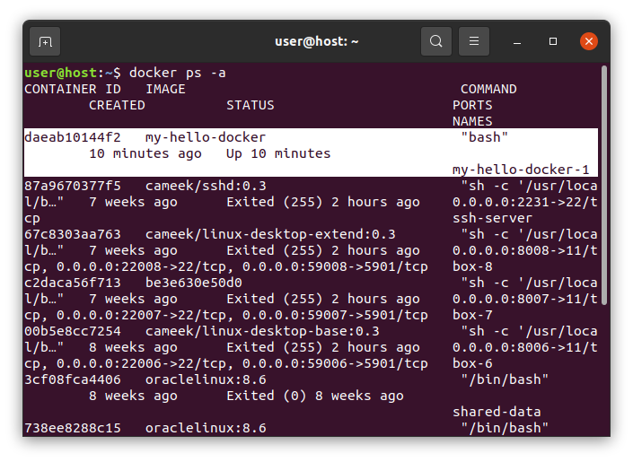

---

# 11. Start / Stop / Remove via GUI 

- Once you have a container created you can perform on it with control buttons:
    - Start / Stop
    - Delete 
    - Open in Terminal
    - Open in Browser 
      (for containers with HTTP srv.)


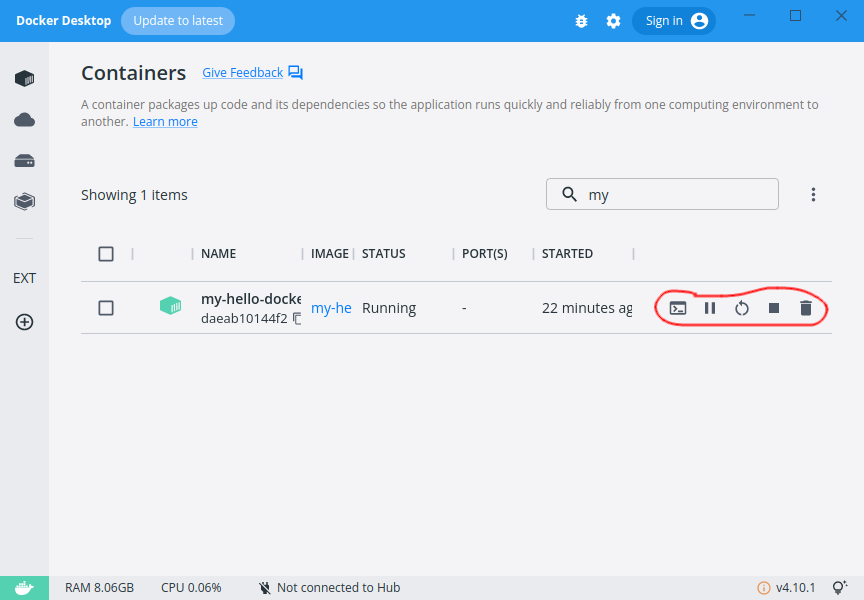

---

# 12. Stop / Remove via CLI

- Stop container:
```sh
docker stop my-hello-docker-1
```
- Remove container:
```sh
docker rm my-hello-docker-1
```

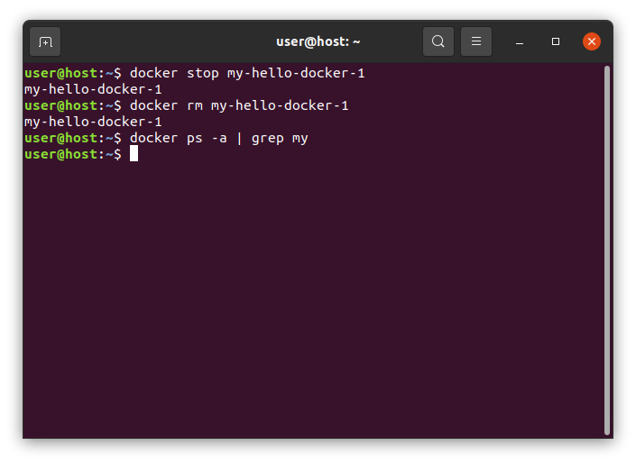

---

# 13. Start and Attach via CLI

- Start container:
```sh
docker start my-hello-docker-1
```
- Attach to terminal of the container:
```sh
docker attach my-hello-docker-1
```

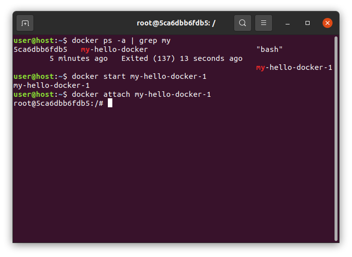

---

# 14. CLI Reference Help

- CLI root reference help is on URL:

https://docs.docker.com/engine/reference/commandline/docker/


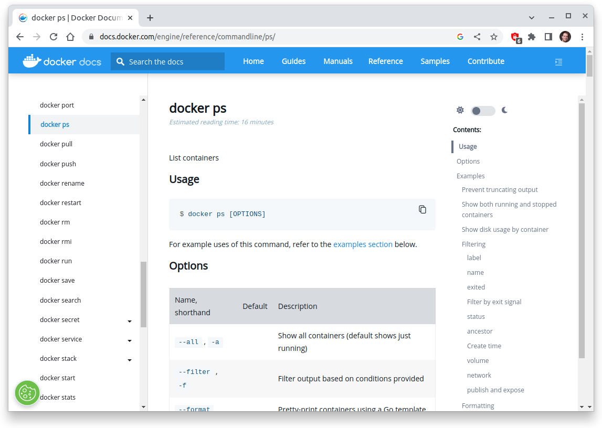